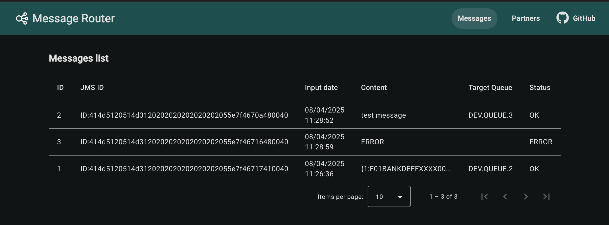

# Messages Router

## Description
**Messages Router** is an application built using Spring-boot, Spring-Integration DSL and Spring Data JPA, to route messages. 
This application uses Java as its server-side platform and Angular on the front-end to provide a responsive user interface.

The aim of the project is to provide a sample project, storing, and routing messages.

---

## Technologies Used

### Back-End
- **Java SDK 17**
- **Spring Boot 3.4.4**
- **Spring Integration DSL**
- **Spring Data JPA**
- **Lombok**

### Front-End
- **Angular v19.1.x**
- **@angular/material v19.2.8**

---

## Features
- **Message Routing**: route messages
- **RESTful API Support**
- **Front-End**: Display messages and partners
-

---

## Routing Graph

Below is a high-level graph representing the routing logic between the input queue, process nodes, and the destination queues:
    
    ```
    +-----------------+           +-------------+           +--------------------+
    |  Input Queue    +---------> |  Root Node  +---------> |  SWIFT Queue       |
    |  DEV.QUEUE.1    |           | (Router)    |           |  (DEV.QUEUE.2)     |
    +-------+---------+           +------+------+           +--------------------+
            |                            |
            |                            |                  +--------------------+
            v                            +----------------> | Other format Queue |
    +---------------------+                                 |  (DEV.QUEUE.3)     |
    |  DEV.DEAD.LETTER    |                                 +--------------------+
    |    QUEUE (Error)    |
    +---------------------+
    ```

### Explanation of the Routing Logic:
1. Messages are **posted to the input queue**: `DEV.QUEUE.1`.
2. At the **Root Node (Router)**, messages are routed based on their content:
   - **SWIFT Messages** (e.g., formatted with SWIFT standards) are routed to: `DEV.QUEUE.2`.
   - **Test Messages** are routed to: `DEV.QUEUE.3`.
   - **Error Messages** (e.g., content includes "ERROR") are routed to the dead letter queue: `DEV.DEAD.LETTER.QUEUE`.
3. The output queues process messages accordingly, simulating real-world routing scenarios.

---

## Prerequisites

### Required Tools:
- **JDK 17** or later
- **Node.js** (with npm) to manage Angular dependencies
- **Docker** & **Docker Compose** for running services

### Configuration:
- Set up **database connection properties** in the `application.properties` file.
- Configure **IBM MQ Series**, including the input, output queues, and target queues (defined in `application.properties`).

---

## How to Run the Project

### Running in test Mode
1. Start all required services using Docker:
   ```bash
   docker-compose up -d
   ```
2. Build the project in the root directory:
   ```bash
   mvn clean install
   ```
3. Navigate to the back-end application folder:
   ```bash
   cd messages-router-app
   ```
4. Run the back-end server:
   ```bash
   mvn spring-boot:run
   ```
5. Access the user interface at:
    - [http://localhost:8080](http://localhost:8080)

---

### Running in Development Mode
1. Start the back-end server (follow the steps above for **Running in test Mode**).
2. Navigate to the front-end folder:
   ```bash
   cd messages-router-front
   ```
3. Install the required dependencies:
   ```bash
   npm install
   ```
4. Start Angular in development mode:
   ```bash
   npm run start
   ```
5. Access the application at:
    - **Back-End REST API**: [http://localhost:8080/api](http://localhost:8080/api)
    - **Development Front-End UI**: [http://localhost:4200](http://localhost:4200)

---

## Testing

### IBM MQ Console
- **Login the IBM MQ Console**: (admin/passw0rd) 
  [https://localhost:9443/ibmmq/console/login.html](https://localhost:9443/ibmmq/console/login.html)
- **Post messages to the input queue**:  
  [https://localhost:9443/ibmmq/console/#/manage/qmgr/QM1/queue/local/DEV.QUEUE.1/view](https://localhost:9443/ibmmq/console/#/manage/qmgr/QM1/queue/local/DEV.QUEUE.1/view)

### Test Scenarios
1. **Test Swift Message**  
   Post the following message to queue `DEV.QUEUE.1`.  
   The message will be routed to the `DEV.QUEUE.2` queue:
   ```plaintext
   {1:F01BANKDEFFXXXX0000000000}{2:I103BANKUS33XXXXN}{4:
   :20:REFERENCE12345678
   :23B:CRED
   :32A:250407EUR12345,67
   :33B:EUR12345,67
   :50K:/1234567890
   JOHN DOE
   123 STREET
   PARIS
   :59:/9876543210
   JANE SMITH
   456 AVENUE
   LONDON
   :70:INVOICE 12345
   :71A:OUR
   -}
   ```

2. **Test Any Message**  
   Post a message with the content `test message` to the queue `DEV.QUEUE.1`.  
   The message will be routed to the `DEV.QUEUE.3` queue.

3. **Test Error Message**  
   Post a message with the content `ERROR` to the queue `DEV.QUEUE.1`.  
   The message will be routed to the `DEV.DEAD.LETTER.QUEUE` queue.

4. **Display Messages list**
   Access the application at: [http://localhost:8080](http://localhost:8080)
   The application display the messages list :
   
